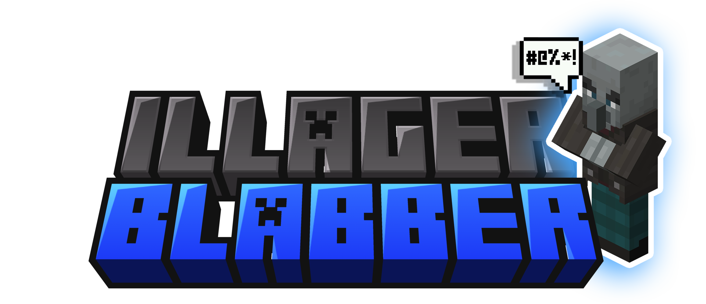

# 🗣️ IllagerBlabber 🗣️

> Because what Minecraft REALLY needed was more yapping illagers! 

  

## What is this monstrosity?

IllagerBlabber adds totally necessary, definitely-not-annoying professional voice lines to all illagers. 
Now when a pillager is about to murder you, he'll let you know with a charming one-liner!

Ever wondered what Vindicators say before chopping you in half? No? **WELL NOW YOU'LL KNOW ANYWAY.**

All the voice lines are vanilla friendly, essentially mimicking their Vanilla voices!!

##  🗣️ Features That Actually Required Brain Cells to make 🗣️

### Advanced Audio System
- Each illager type has unique voice lines (Pillagers sound crude, Vindicators sound ANGRY, Evokers sound snobby)
- Context-aware dialogue system (different lines when):
    - Passive
    - Spotting a player or any target for the first time
    - Being mid-battle
    - Getting hurt
    - Celebrating a kill (rude!) or target runs away

### Smart Sound Management
- Dynamic cooldown system that scales based on illager density
    - No more audio hell when fighting raids!
    - The more illagers (of one type) present, the less frequently each one speaks to prevent audio spam
    - Mathematical formula ensuring optimal audio experience ~~_(trust me bro)_~~

### Cool stuffs
- Minimal performance impact
- Fully client side
- VERY lively illagers!

## 🗣️ Use alongside [Sound Physics Remastered](https://modrinth.com/mod/sound-physics-remastered) for maximum immersion!

## Future Plans

- More illager types (looking at you, Illusioner)
- Full mod compatibility with popular illager-adding mods
- Therapy for players traumatized by pillager voices
- **Villagerblabber!** 🗣️

---

*Voiced by me, using custom illager ai voice models*
